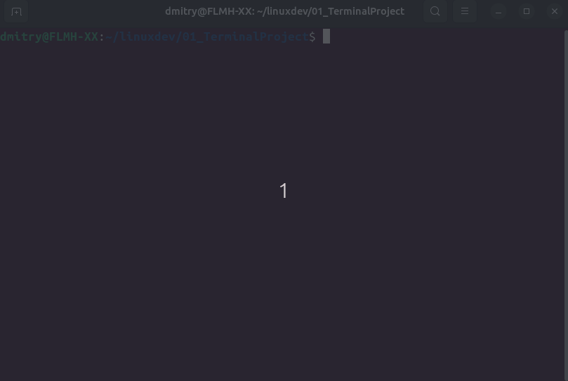

## Description
This is a directory for the first task `01_TerminalProject` of the course [Linux application development](http://uneex.org/LecturesCMC/LinuxApplicationDevelopment2024).

## The task
Implement a file shower by means of `ncurses`:
* Program `Show.c` gets path to regular file in command line argument;
* Program creates a window where the file is displayed. The first line contains file name and number of lines.
* Shower options:
    - `Space` or `↓`: scroll line down;
    - `↑`: scroll line up;
    - `←`: scroll column left;
    - `→`: scroll column right;
    - `PgUp`: scroll page up;
    - `PgDn`: scroll page down;
    - `Esc`: quit the program.
* It is OK to map whole file in memory;
* File encoding: ASCII;
* Executable name: `Show`.

## Build
To build the program run `make all`.

